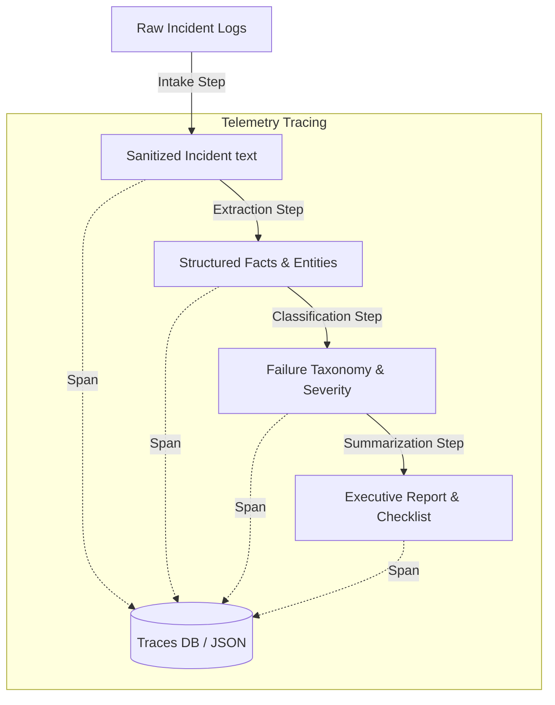

# ⚡ Failure Forensics Co-Pilot

An agentic, multi-stage RAG processing pipeline designed to ingest, classify, analyze, and summarize system failure logs. The project features automated E2E orchestration, deep observability (fine-grained telemetry tracing to SQLite and JSON archives), and robust self-confidence scoring models.

---

## 🗺️ Project Architecture & Workflow

The Failure Forensics Co-Pilot parses complex incident logs and transforms them into structured, actionable post-mortem reports.



### The 4-Step Stateless Pipeline
1. **Intake (`pipeline/intake.py`)**: Normalizes input incident texts, extracts relevant filenames, and counts character stats.
2. **Extraction (`pipeline/extraction.py`)**: Extracts structured facts, system entities, timestamps, and error codes using modern OpenAI Structured Outputs.
3. **Classification (`pipeline/classification.py`)**: Categorizes failures (e.g., Database, Network, Auth) and assigns severities (Critical, Major, Minor) validated with strict Pydantic schemas.
4. **Summarization (`pipeline/summarization.py`)**: Synthesizes the extracted facts and classifications into high-impact executive summaries and remediation checklists.

---

## 🔬 Observability & Telemetry

Observability is built directly into the core design of the engine:

- **Step-level Spans (`tracing/span.py`)**: Every step executes as an isolated span, automatically tracking inputs/outputs, start-to-end latencies (in milliseconds), OpenAI token metrics, raw context prompt/responses, and raw python traceback strings on failure.
- **Trace Chaining (`tracing/trace.py`)**: Aggregates separate child spans into an integrated execution trace with consolidated telemetry (overall token counts, E2E processing latency).
- **Execution Decorators (`tracing/instrumentation.py`)**: Provides a zero-boilerplate `@instrument` decorator that transparently instruments pipeline steps using thread-safe `contextvars`.
- **Atomic Storage (`tracing/storage.py`)**: Atomically writes trace data as structured JSON files in the `traces/` archive folder and commits them inside SQLite tables via a transaction-managed database boundary to `traces.db`.

---

## 🎯 Confidence Scoring & Threshold Alerts

- **Co-generation Principle**: Self-confidence scoring is co-generated in a single pass alongside the primary step payload (no separate LLM calls required).
- **Type Resilience**: Utilizes `ConfidenceSchema` (`utils/thresholds.py`) and Pydantic `@field_validator` hooks to gracefully convert loose mock values or non-standard scores (e.g. `"High"`, `"90%"`) to a standard default (`3`).
- **Threshold Warning Trigger**: Logs real-time warning indicators when any step's self-confidence score drops below or equal to `2` out of `5`.

---

## 📁 Repository Directory Structure

```text
├── .claude/               # Agentic spec configurations & prompts
├── analysis/              # Root-cause analytics & diagnostics package
├── api/                   # FastAPI routing service boundaries
├── eval/                  # Golden dataset evaluation metrics
├── pipeline/              # Pure transformation step pipeline
│   ├── intake.py          # Stage 01: Normalizer & ingestion step
│   ├── extraction.py      # Stage 02: Structured entity extractor
│   ├── classification.py  # Stage 03: Severity & taxonomy classifier
│   ├── summarization.py   # Stage 04: Report & checklist generator
│   └── runner.py          # E2E pipeline runner & tracing coordinator
├── tests/                 # Automated offline validation tests
├── tracing/               # Observability telemetry & database persistence
│   ├── instrumentation.py # Context-managed timers and decorators
│   ├── span.py            # Span models
│   ├── trace.py           # Consolidated Trace models
│   └── storage.py         # Disk JSON archiving & SQLite transactions
├── ui/                    # Streamlit visual Trace Explorer frontend
├── utils/                 # General utils (logger, settings, thresholds)
├── Dockerfile             # Multi-stage production container runner
├── docker-compose.yml     # Local orchestration setup
├── schema.sql             # Relational database layout (traces & spans)
└── requirements.txt       # Core project dependency locking
```

---

## ⚙️ Setup & Configuration

### Prerequisites
- **Python 3.10+** (Python 3.13 recommended)
- **Git**
- **Docker** (Optional, for containerized deployments)

### 1. Installation
Clone the repository and install core dependencies:
```bash
git clone https://github.com/KrushnakantKulkarni/Rag-project-Ant.git
cd Rag-project-Ant
python -m venv .venv
# Activate the environment:
# Windows (PowerShell): .venv\Scripts\Activate.ps1
# Linux/macOS: source .venv/bin/activate
pip install -r requirements.txt
```

### 2. Configuration Setup
Create a `.env` file at the project root matching the schema in `.env.example`:
```ini
OPENAI_API_KEY=your-openai-api-key-here
API_KEY_SECRET=your-fastapi-access-key-here
DATABASE_PATH=traces.db
TRACE_ARCHIVE_DIR=traces/
LOG_LEVEL=INFO
```

---

## 🚀 Running the System

### 1. Execution via Pipeline Runner
You can run the pipeline sequentially on an incident document directly:
```python
from pipeline.runner import execute_pipeline

result = execute_pipeline(
    filepath="path/to/incident_log.txt",
    raw_content="Database connection timeout at 2026-05-28T14:43:00. Critical error: 504 Gateway Timeout."
)

print(f"Status: {result.status}")
print(f"Classification: {result.classification.category} - {result.classification.severity}")
print(f"Summary Checklist: {result.summarization.checklist}")
```

### 2. Launching Services
Run the backend REST API:
```bash
uvicorn api.main:app --reload --port 8000
```

Run the Streamlit interactive dashboard:
```bash
streamlit run ui/app.py --server.port 8501
```

---

## 🧪 Testing and Validation

The project provides an offline test suite that mocks out external API network calls. To run all verification checks:

```bash
python -m pytest
```

---

## 🤖 Custom Slash Commands

The workspace integrates with the custom agentic blueprints. The following slash commands can be recommended to speed up execution:

- `/build-phase <phase-number> <slug>`: Check out a feature branch and boot up plans.
- `/seed-documents`: Automatically generates test failure log entries inside `data/seed_failures/`.
- `/run-pipeline <dir>`: Processes directory logs through the steps and populates the telemetry database.
- `/trace-failure <trace-id>`: Conducts backward step-by-step diagnostic analysis on a trace.
- `/code-review-phase <slug>`: Spawns subagents to audit local modifications for security, tracing, and design standards.
- `/ship-phase <slug>`: Verifies regressions, updates git versioning, and pushes to remote repositories.
