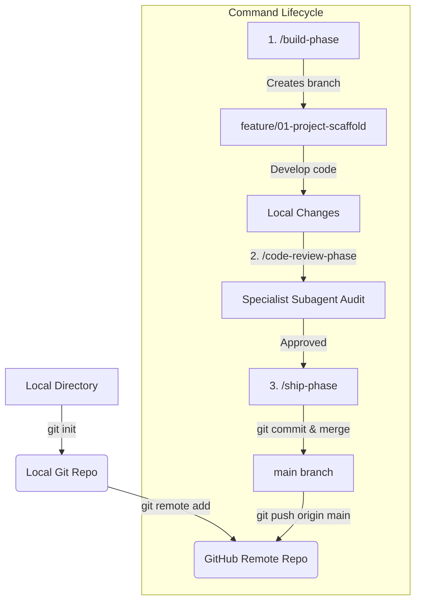

# 🐙 Failure Forensics Tool: Git & GitHub Integration Guide

This guide provides a comprehensive walkthrough for setting up your local Git repository and remote GitHub repository, specifically tailored to integrate with the agentic `/build-phase`, `/code-review-phase`, and `/ship-phase` slash commands defined in the `.claude/` blueprints.

---

## 🗺️ How Git Integrates with the Agentic Workflow

The custom commands in your `.claude` folder rely heavily on standard Git operations to manage code quality gates:



---

## 🚀 Step 1: Initialize Local Git Repository

Open **PowerShell** or your terminal inside the workspace directory (`e:\ai-projects\Rag-project-Ant\`) and run the following commands:

### 1. Initialize Git
```powershell
git init -b main
```
> [!NOTE]
> The `-b main` flag ensures that your default branch is named `main` instead of the legacy `master`.

### 2. Configure a `.gitignore` File
Create a `.gitignore` file to ensure you do not commit sensitive files, databases, or local virtual environments. 

Create a new file named `.gitignore` at the root of the project:
```text
# Local virtual environment
.venv/
__pycache__/
*.pyc

# Local Database & telemetry logs (Protected by settings.json)
traces.db
traces/
eval/eval_dataset.json

# Local Environment Variables & Secrets
.env
.env.local

# IDE configurations & system files
.DS_Store
Thumbs.db
.vscode/
```

### 3. Make Your Initial Commit
Commit the existing `.claude` and workspace files to start the history tracking:
```powershell
git add .
git commit -m "chore: initial commit of Failure Forensics blueprint configuration"
```

---

## 🌐 Step 2: Create and Link Your GitHub Repository

To back up your code and enable the automatic pulling and pushing actions performed in the `/ship-phase` command, configure a remote GitHub repository.

### 1. Create a Repository on GitHub
1. Go to [github.com](https://github.com/) and log into your account.
2. Click the **New** button (or go to `github.com/new`).
3. Set your repository name (e.g., `Rag-project-Ant` or `Failure-Forensics-Tool`).
4. Keep it **Public** or **Private** as per your preference.
5. **IMPORTANT:** Do NOT initialize the repository with a README, `.gitignore`, or License (as you already have them locally).
6. Click **Create repository**.

### 2. Link Local Repository to GitHub
Copy the remote repository URL and run the following commands in your local terminal:

```powershell
# 1. Add your GitHub repository as the 'origin' remote
git remote add origin https://github.com/<your-username>/<your-repo-name>.git

# 2. Push your initial main branch to GitHub and set upstream tracking
git push -u origin main
```

---

## 🛠️ Step 3: Run the Agentic Phase Command Loop

Once your repository is linked, you can fully leverage the custom `/build-phase`, `/code-review-phase`, and `/ship-phase` slash commands.

### 1. Starting a New Phase (`/build-phase`)
When you are ready to begin Phase 01:
```text
/build-phase 01 project-scaffold
```
* **What it does:** Ensures your git status is clean, then automatically runs `git checkout -b feature/01-project-scaffold` and prepares the implementation plan artifact.

### 2. Auditing Changes (`/code-review-phase`)
When you've finished implementing a phase's specs and want an audit:
```text
/code-review-phase project-scaffold
```
* **What it does:** Extracts your local changes using `git diff HEAD` and passes them to three specialist auditor subagents to verify the schema, tracing boundaries, and security elements.

### 3. Shipping the Phase (`/ship-phase`)
When the code is fully validated, tested, and ready to be integrated:
```text
/ship-phase project-scaffold
```
* **What it does:**
  1. Runs all unit tests and checks for telemetry regressions.
  2. Packages all files and commits them with a standardized conventional commit: 
     `feat(project-scaffold): implement project-scaffold specifications and instrumentation`.
  3. Automatically switches to `main`.
  4. Pulls upstream changes (`git pull origin main`).
  5. Merges your feature branch into `main` (`git merge --no-ff`).
  6. Pushes the integrated changes back to GitHub (`git push origin main`).
  7. Cleans up the local feature branch safely.

---

## ⚠️ Important Best Practices
> [!WARNING]
> Do not force-delete or manually edit files inside the `.claude/` folder, as they define the project requirements and schemas.

> [!IMPORTANT]
> Always verify that your `.env` file is excluded from your git status. Never commit API keys (`OPENAI_API_KEY`, etc.) or local SQLite `.db` binaries to public repositories.
