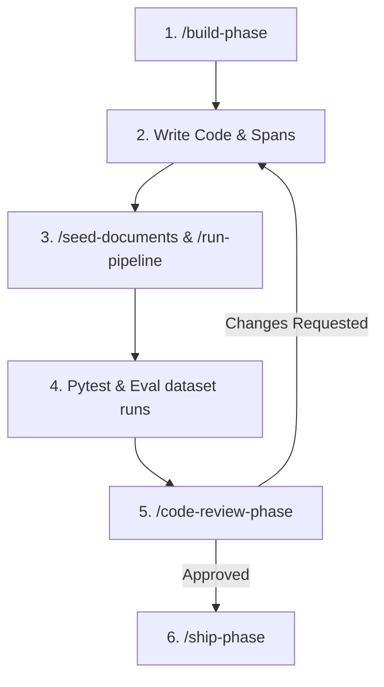

# ⚡ Failure Forensics Co-Pilot: Step-by-Step Usage Guide

Welcome to the step-by-step guide for using the **Failure Forensics Tool** agentic configuration setup. This guide explains how to use the `.claude/` blueprints, custom slash commands, subagents, and skills to build, test, and ship your pipeline observability layers.

---

## 🗺️ Developer Lifecycle Overview

The complete agentic lifecycle follows this structured workflow:



---

## 🚀 Step 1: Initialize a New Phase Branch
When starting any feature phase (e.g., Phase 01: Project Scaffold), use the `/build-phase` slash command. This command automatically sets up the feature branch, injects the specifications spec file, and boots the co-pilot planning sequence.

```bash
# syntax: /build-phase <phase-number> <slug>
/build-phase 01 project-scaffold
```

**What the agent does under the hood:**
1. Checks that your active git state is clean.
2. Checks out a new branch: `feature/01-project-scaffold`.
3. Loads `.claude/specs/01-project-scaffold.md` into active context.
4. Generates an `implementation_plan.md` artifact outlining the specific files to be created and waits for your approval.

---

## 📐 Step 2: Implement Code Guided by Skills
While coding your pipeline steps and tracing decorators, the workspace automatically injects domain-specific architectural skills to maintain consistency.

### Enforced Conventions:
* **Module boundaries**: Pipeline steps reside in `pipeline/`, telemetry models in `tracing/`, and API routes in `api/`.
* **Step structure**: Every step is a pure function returning a typed Pydantic output model:
  ```python
  def run_step(input_data: StepInput) -> StepOutput:
  ```
* **Span decorators**: Use the `@instrument` decorator to intercept latencies, token counts, and confidence scores (1-5 range) seamlessly inside primary LLM responses.

---

## 🧪 Step 3: Seed Documents & Run the Pipeline
To test the pipeline's robustness and generate diagnostic traces, you need to populate the workspace with test inputs.

### 1. Seed simulated failure documents:
Run `/seed-documents` to generate eight curated files inside `data/seed_failures/` designed to trigger specific pipeline anomalies:
```bash
/seed-documents
```

### 2. Execute the pipeline:
Execute `/run-pipeline` on the target directory to process text documents, serialize telemetry JSON logs to `traces/`, and log index entries into `traces.db`:
```bash
# syntax: /run-pipeline <document-directory>
/run-pipeline data/seed_failures
```

---

## 🔍 Step 4: Run Backward Trace Walk-Backs
When an execution finishes with low confidence or fails, utilize the `/trace-failure` command to run a root-cause forensic walk-back.

```bash
# syntax: /trace-failure <trace-id>
/trace-failure tr-9087-abc
```

**What the agent does under the hood:**
1. Loads telemetry data from `traces/tr-9087-abc.json`.
2. Inspects steps in reverse order: `Summarization` ➔ `Classification` ➔ `Extraction` ➔ `Intake`.
3. Analyzes where confidence scores dropped or errors were recorded.
4. Maps findings to one of the five canonical classifications (`EXTRACTION_HALLUCINATION`, `MISCLASSIFICATION`, `PROPAGATION_ERROR`, `PROMPT_FAILURE`, `CONTEXT_LOSS`).
5. Returns a structured diagnostic report with actionable fixes.

---

## 🖥️ Step 5: Launch the Interactive Dashboard
To view execution flows visually, debug latency metrics, compare three-column payload diffs, and flag cases interactively:

1. **Start the FastAPI backend**:
   ```bash
   # Executes the uvicorn launch profile defined in launch.json
   uvicorn api.main:app --reload --port 8000
   ```
2. **Start the Streamlit Trace Explorer**:
   ```bash
   # Executes the streamlit launch profile defined in launch.json
   streamlit run ui/app.py --server.port 8501
   ```

Open your browser at `http://localhost:8501` to view your pipeline graph and trigger walk-backs inline.

---

## 🤖 Step 6: Trigger Parallel Specialist Audits
Before committing your phase adjustments, spawn parallel specialist reviewer subagents to audit your code changes.

```bash
# syntax: /code-review-phase <phase-spec-slug>
/code-review-phase project-scaffold
```

**Subagent Collaboration Flow:**
* **`forensics-pipeline-reviewer`** audits your code boundaries and step function type schemas.
* **`forensics-trace-reviewer`** audits decorator capture completeness and SQLite database transaction atomic logs.
* **`forensics-security-reviewer`** audits access control security blocks, credential safety, and prompt injection filters.

The command combines all observations, filters duplicates, rates them by severity, and returns a unified report with a **Verdict: APPROVED** or **Verdict: CHANGES REQUESTED**.

---

## 🚢 Step 7: Ship the Completed Phase Branch
Once the parallel reviewers approve and your changes pass manual evaluations, invoke `/ship-phase` to perform the final automated delivery sequence.

```bash
# syntax: /ship-phase <phase-spec-slug>
/ship-phase project-scaffold
```

**What the agent does under the hood:**
1. Runs the test suite via the **`forensics-test-runner`** subagent.
2. Compares evaluation accuracy scores against historical golden datasets under `eval/eval_dataset.json`.
3. Stalls execution if any performance metric regresses.
4. If successful, writes a standardized conventional commit:
   `feat(project-scaffold): implement Phase 01 repository scaffold specifications`
5. Checks out `main`, integrates the feature branch, and deletes the local branch.
